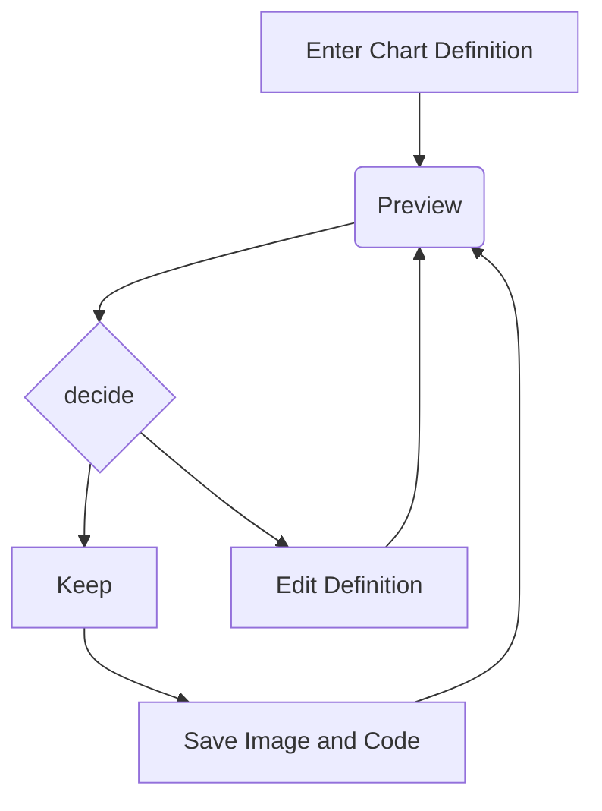

Notas são a principal estrutura do Obsidian e funcionam como um arquivo de texto em que podemos adicionar imagens, tabelas e diversos outros elementos através da linguagem de marcação Markdown.

Na pratica as notas são arquivos .md salvos diretamente em seu computador, uma grande vantagem que nos trás a segurança de não ficar presos a ferramenta, já que caso a ferramenta quebre ou dê algum problema, nossos arquivos estão intactos e sobre o nosso controle e podemos utiliza-los em diversas outras ferramentas.

Vamos explorar algumas possibilidades do Markdown!

Ao apertar com o botão direito em qualquer ponto da nota você pode adicionar diversos elementos, como:

Código
```python
print('Olá novos usuarios! Bem vindos ao Obsidian!)
```


Tabela

| Qnt Usuarios | Preferencia depois de conhecer o Obsidian |
| ------------ | ----------------------------------------- |
| 9990         | Obsidian                                  |
| 10           | Notion                                    |

> [!NOTE] Isso é uma anotação!
> Muito util para ressaltar pontos importantes em uma anotação longa ou estudo

---
# Titulo 1
## Titulo 2
### Titulo 3

Link Externos:
[Obsidian](https://obsidian.md/)

E claro, os links Internos:

[[2. Plugins]]

Links são a parte mais interessante do Obsidian, permitindo vincular notas e navegar de forma mais simples entre elas. Além do link simples como o a cima, podemos fazer um link com uma "mascara" utilizando | logo após o nome da nota.

[[2. Plugins|Plugins]]

Podendo aproveitar do contexto atual para o link.

___
Além desses usos quem já conhece mais de Markdown, experimente utilizar as outras marcações que já está acostumado como o [Mermaid](https://mermaid.js.org/syntax/flowchart.html):



Ótimo agora que já entendeu um pouco mais sobre o que são as notas, siga para a próxima!
[[2. Plugins]]